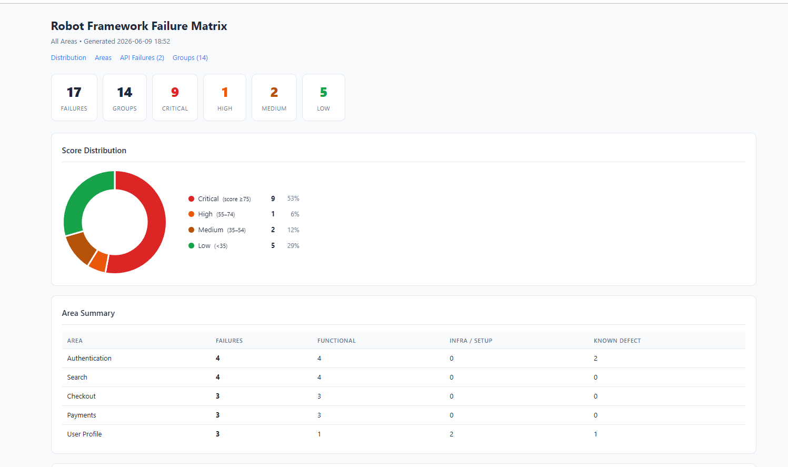

# Robot Framework MCP Server

[](https://github.com/Matthew-M-King/robot-framework-mcp-server/actions/workflows/ci.yml)


A local Python MCP server for analysing Robot Framework `output.xml` results and exposing structured failure data to Claude Desktop and Claude Code.

---

## Why?

Large Robot Framework suites often produce hundreds of failures across dozens of areas.
Instead of manually reading `output.xml` files, this MCP server:

- groups failures by shared root cause
- prioritises by business impact and severity tags
- escalates API/server errors automatically (5xx → 92, 4xx → 87, 403 → 80)
- generates interactive HTML reports with score-distribution charts
- provides Claude with full keyword traces for rapid debugging

The result: a triage session that takes minutes instead of hours.

---

## Quick Start

```bash
# 1. Install
pip install -r requirements.txt
pip install mcp

# 2. Start the server
python -m uvicorn robot_mcp_server.http_server:app --host 127.0.0.1 --port 8000

# 3. In Claude — ingest your results, then triage
ingest_results(results_dir="/path/to/results")
generate_failure_matrix(output_path="/path/to/report.html")
get_triage_queue()
```

API docs available at `http://127.0.0.1:8000/docs` once the server is running.

---

## Demo


## Interactive HTML Report



---

## Why not just inspect output.xml manually?

| Manual review | Robot Framework MCP Server |
|---|---|
| Hundreds of unranked failures | Ranked triage queue — highest impact first |
| Manual root-cause grouping | Automatic fingerprint clustering |
| Raw XML | Interactive HTML with doughnut chart |
| Ctrl+F through log files | SQL queries against a structured database |
| Status code only | Actual API error message extracted from response body |
| Separate tool per task | Single MCP interface for Claude Desktop and Claude Code |

---

## Features

| Feature | Status |
|---------|--------|
| Root cause grouping via fingerprinting | ✅ |
| Failure scoring (0–100, multidimensional) | ✅ |
| API error escalation + message extraction | ✅ |
| Interactive HTML reports | ✅ |
| Claude Desktop support | ✅ |
| Claude Code support | ✅ |
| SQLite persistence | ✅ |
| Idempotent ingestion | ✅ |
| Ad-hoc SQL querying | ✅ |
| Per-test keyword trace for debug context | ✅ |

---

## Installation

```bash
python -m pip install -r requirements.txt
pip install mcp
```

## Connecting to Claude Desktop

Add to `%APPDATA%\Claude\claude_desktop_config.json`:

```json
{
  "mcpServers": {
    "robot-framework-failure-review": {
      "command": "python",
      "args": ["C:\\path\\to\\robot-framework-mcp-server\\examples\\mcp_stdio_wrapper.py"],
      "env": {
        "BASE_URL": "http://127.0.0.1:8000"
      }
    }
  }
}
```

Then restart Claude Desktop. The server appears under the **+** → **Connectors** menu.

## Connecting to Claude Code

The `.claude/settings.json` in this repo configures the MCP server automatically for Claude Code when working in this directory.

---

## Documentation

- [Architecture and design decisions](docs/architecture.md)
- [Configuration — results layout, database initialisation, area categories](docs/configuration.md)
- [MCP tools reference and typical workflow](docs/tools.md)
- [Failure scoring rubric](docs/scoring.md)
- [SQL query examples](docs/sql-examples.md)

---

## Tests

```bash
pytest
```
